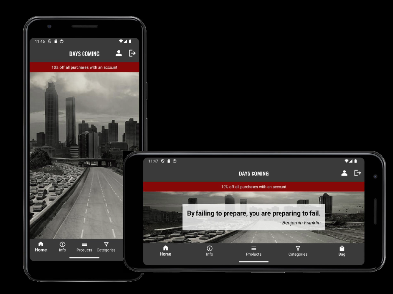

---
# Days Coming App #
Days coming is a fictitious ecommerce android application. 

Days Coming is a business to consumer online retailer for apocalyptic preperation also known as [survivalism](https://en.wikipedia.org/wiki/Survivalism). The products on the site reflect the theme of survivalism such as [MRE'S](https://en.wikipedia.org/wiki/Meal,_Ready-to-Eat), and [living off the grid](https://en.wikipedia.org/wiki/Off-the-grid). 

---
**TABLE OF CONTENTS**
* [User Experience](#user-experience)
    * [User Stories](#user-stories)
* [Features](#features)
    * [Application Features](#application-features)
    * [Future Features](#future-features)
* [Typography & Color Scheme](#typography-and-color-scheme)
* [Wireframes](#wireframes)
* [Technologies User](#technologies)
    * [Languages Used](#languages-used)
    * [Libraries](#libraries)
    * [Database](#database)
    * [Testing Libraries](#testing-libraries)
    * [Build and Dependency Management](#build-and-dependency-management)
    * [Plugins](#plugins)
    * [Configuration](#configuration)
    * [Dependencies Block](#dependencies-block)
    * [Project Structure](#project-structure)  
* [Media](#media)
    * [Background Images](#background-images)
    * [Product Images](#product-images)


---
# User Experience

### User Stories
HomePage 
- As a user I want to be able to tell what the website is about.


Toolbar <strong><u>(Not logged in)</u></strong>
- As a user I want to be able to see the website name.
- As a user I want to be able to see that I am not logged in via the user icon. 

Toolbar <strong><u>(Logged in)</u></strong>
- As a user I want to be able to see the website name.
- As a user I want to be able to see the sign out icon.
- As a user I want to be able to see the profile icon.

Bottom Navigation Menu.
- As a user I want to be able to have a home button.
- As a user I want to be able to have a information button.
- As a user I want to be able to have an all products button.
- As a user I want to be able to filter all the products via categories.
- As a user I want to be able to have a bag button.

Register

- As a user I want to be able to register.
- As a user I want to recieve a confirmation notification that I have registered.


Login

- As a user I want to be able to login with username and password.
- As a user I want to recieve a notification that I have attempted login with incorrect information.
- 

Logout

- As a user I want to be able to logout.
- As a user I want to recieve a confirmation notification that I have logged out.

All Products

- As a user I want to be able to see the products.
- As a user I want to be able to see an image, name and price. 

Product Detail

- As a user I want to be able to see the product.
- As a user I want to be able to see the description.
- As a user I want to be able to choose the quantity. 
- As a user I want to be able to add to my bag. 

FAQ page

- As a user I want to see information on questions that are asked frequently.
- As a user want to see delivery information.
- As a user I want to see contact information.

Contact Page. 

- As a user I want to be able to contact the app admin.
- As a user I want to be able to send questions. 
- As a user I want to recieve a notification that the form has been sent.

# Features

## Application Features

### ToolBar
- Featured at the top of the screen.
- Displays name of the application.
- It contains the icon links for sign in, profile and sign out depending on if a user is signed in or not. 

| Not Signed In | Signed In |
|:-------------:|:---------:|
|  |  |


### Bottom Navigation Menu
- Featured at the bottom of the screen.
- Displays the links for the website. 

| Home Icon      | Information Icon      | Products Icon      | Categories Icon      | Users Bag Icon      |
|----------------|-----------------------|--------------------|----------------------|---------------------|
|  |  |  |  |  |

### Icons Description

- **Home Icon**: Used for the home screen.
- **Information Icon**: Used to display information.
- **Products Icon**: Represents the products list.
- **Categories Icon**: Used for filtering by categories.
- **Users Bag Icon**: Represents the user's shopping bag.

### Register
- The register page has a form.
- The form displays the details needed.
- If username is already in use it will ask you to fill out form again.
- Once you register you are re-directed to login page.

### Login
- This page contains a form.
- The form displays where to type name and password.
- If a user enters the incorrect username they will recieve an error.

### Logout 
- When logging out a user will recieve a notification.
- When logging out user wll be re-directed to home page.

### All Products
- A user can see all the products.
- A user can see an image of the product.
- A user can see the name of the product.
- A user can see the price of the product.

### Product Detail
- A user can see all the products.
- A user can see an image of the product.
- A user can see the name of the product.
- A user can see the description of the product.
- A user can see the rating of the product.
- A user can see the price of the product.
- A user can choose quantity of the product.
- A user can add product to bag.

### Bag 
- A user can see what is in their bag.
- A user can see the bag total in Euro.
- A user can see the delivery price in Euro.
- A user can see the grand total(product and delivery) in euro.
- A user can see button to keep shopping.
- A user can see button to secure checkout. 

### Checkout
- A user can enter card details.
- A user can enter delivery address.
- A user can see button buy now.

### Profile.
- A user can update their address.
- A user can view past orders. 

### Toasts
These are available when a user:
- Log in
- Register
- Logout
- Add a product to the bag
- Submit the contact form

# Future Features
- In the future I would like to enable CRUD for admin on products.
- In the future I would like to enable CRUD for admin on users.
- In the future I would like to enable reviews for users.

# Typography and Color Scheme

## <u>Font</u>
The fonts used in this project were:
- [Roberto](https://fonts.google.com/specimen/Roboto). This was used in the body of the project.
- [Oswald](https://fonts.google.com/specimen/Oswald). This was used on headers through out the project. 

## <u>Color Scheme</u>

The colout scheme used was:
- Dark gray #535453
- Light gray #D3D3D3
- Red #808080

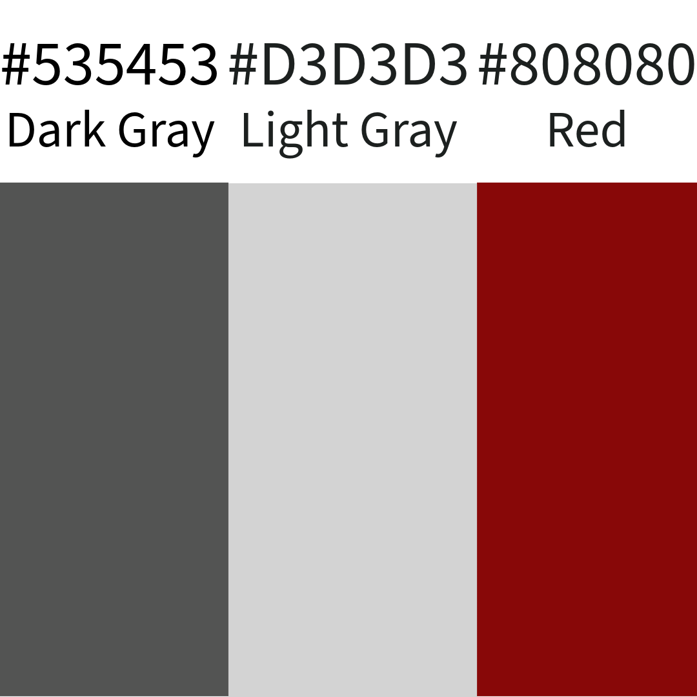

## Wireframes

### Home and Info Pages

| Home Page   | Info Page   |
|-------------|-------------|
| 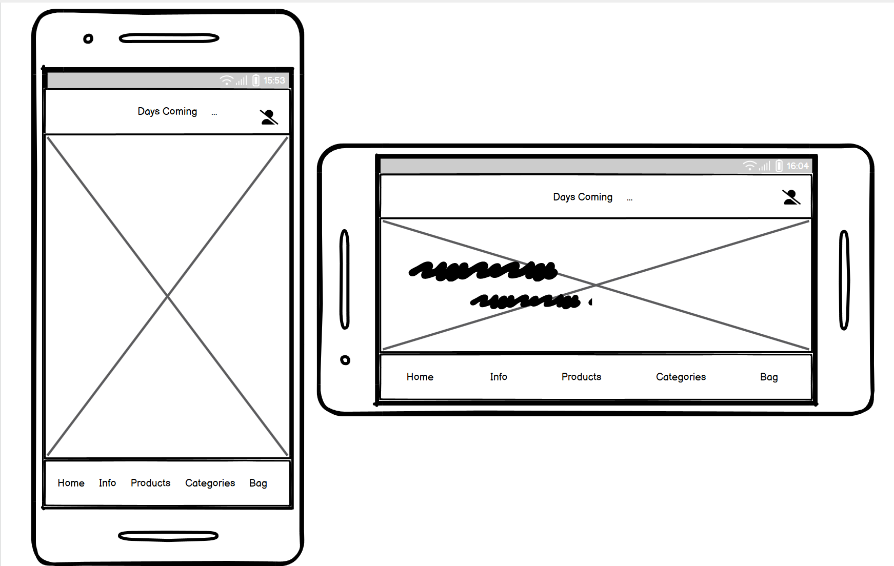 | 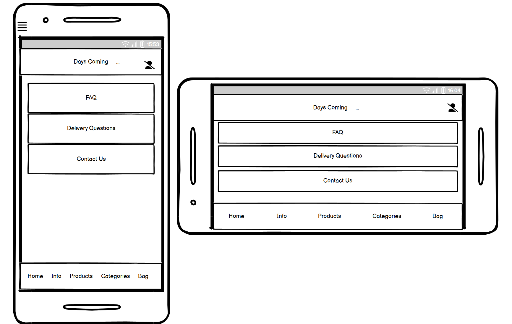 |

### Product Pages

| Product List | Product Detail |
|--------------|----------------|
| 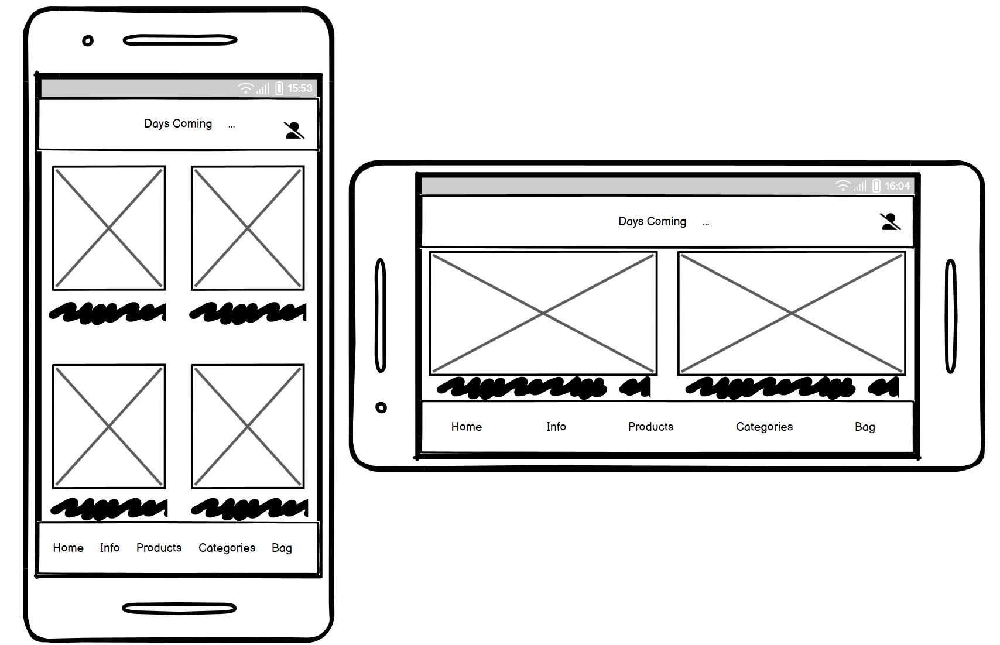 | 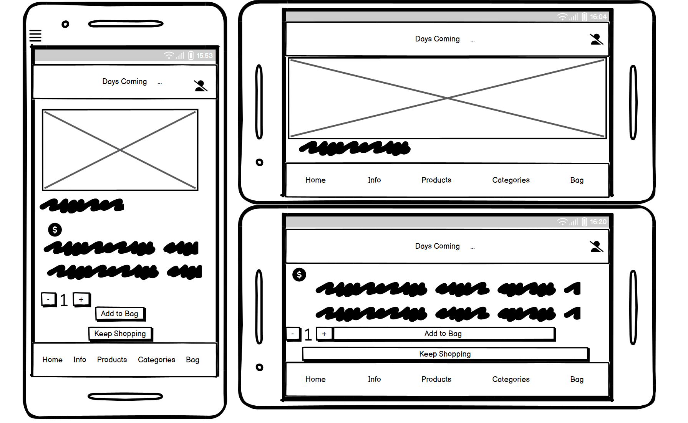 |

### Checkout and Contact Us Pages

| Checkout Page | Contact Us Page |
|---------------|-----------------|
| 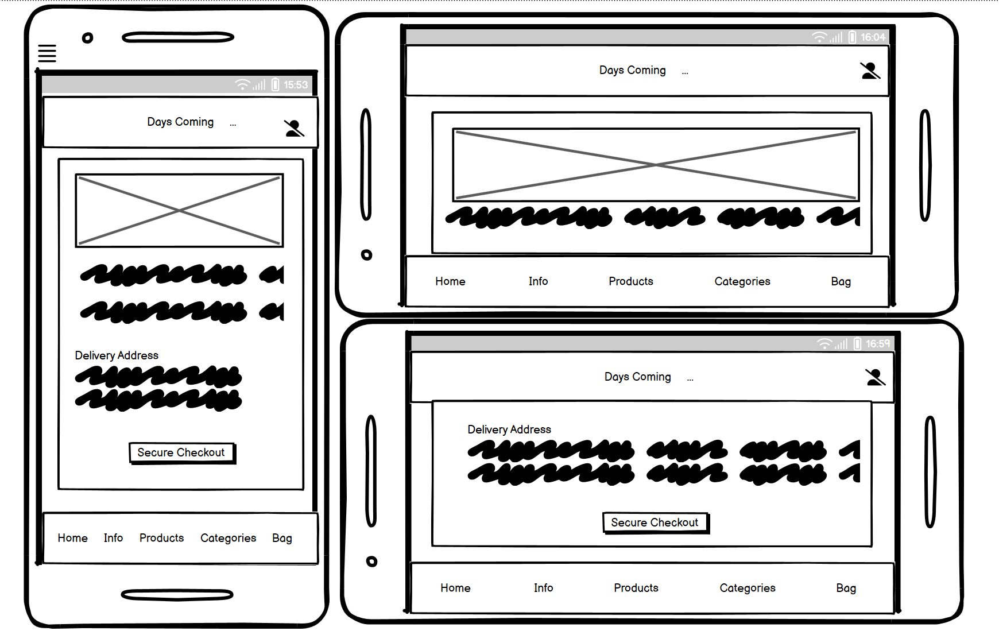 | 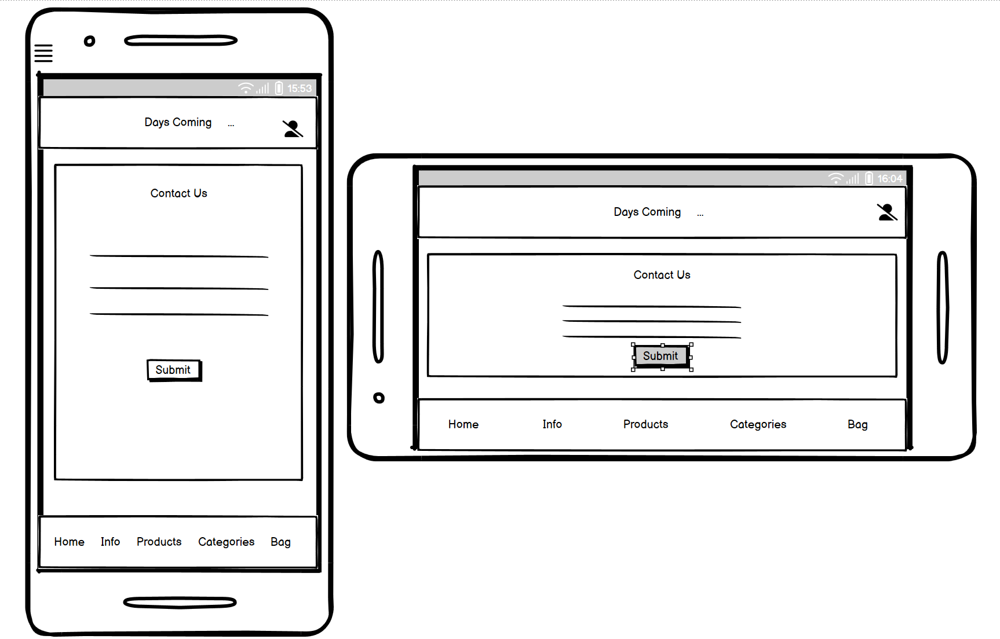 |

### Bag and Profile Pages

| Bag Page   | Profile Page   |
|------------|----------------|
| 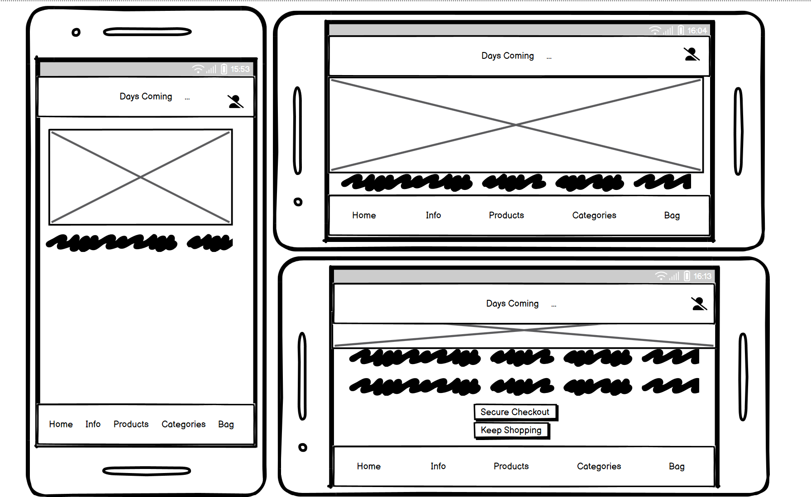 | 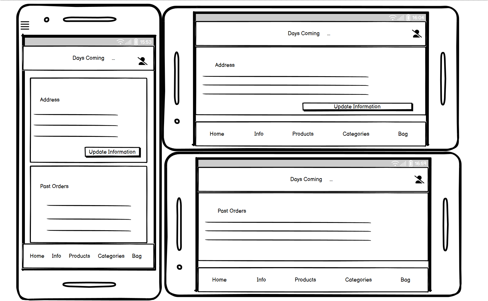 |

### Register and Login Pages

| Register Page | Login Page |
|---------------|------------|
| 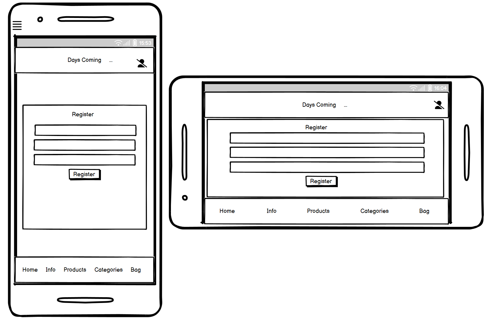 | 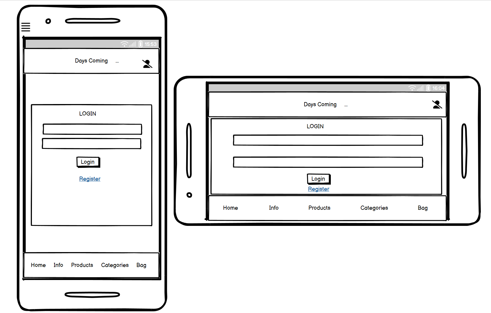 |

### Logout and Signed In/Not Signed In Pages

| Logout Page | Signed In/Not Signed In |
|-------------|-------------------------|
| 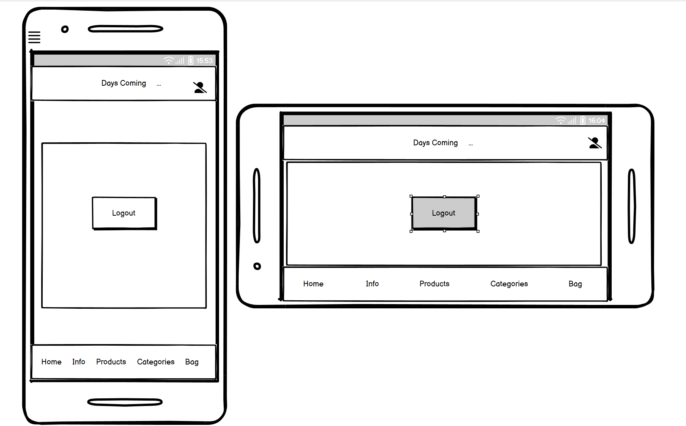 | 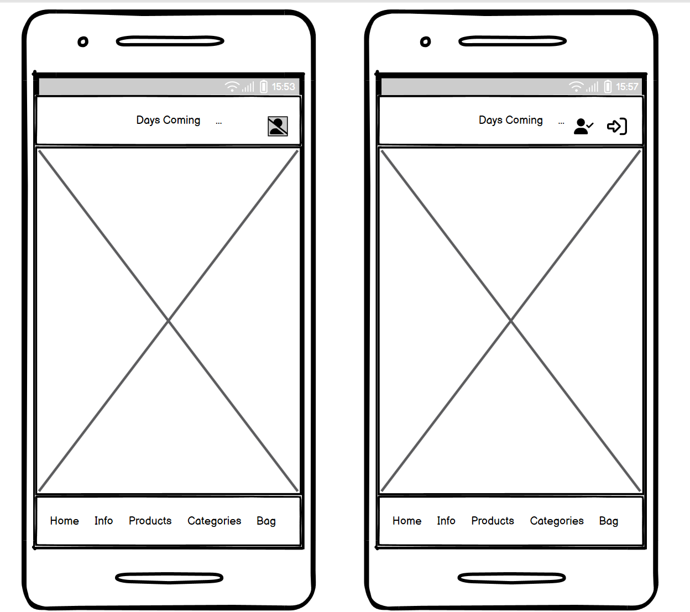 |

# Technologies

## Languages Used
- [Kotlin: Version 1.8.0](https://kotlinlang.org/docs/releases.html)
    - The primary programming language used for Android development, known for its concise syntax, interoperability with Java, and modern features.
- [Java: Version 1.8](https://www.java.com/en/download/)
    - Utilized for some legacy code and compatibility purposes.

### Android SDK

- **Android Gradle Plugin (AGP)**: Version 8.3.2
  - Essential for building and managing the Android project lifecycle.

### Libraries

- **AndroidX AppCompat**: Version 1.6.1
  - Provides backward-compatible versions of Android components and UI elements.
- **Material Components for Android**: Version 1.12.0
  - Implements Material Design UI components, ensuring a consistent look and feel across the application.
- **AndroidX Activity**: Version 1.8.0
  - Enhances Activity lifecycle management and integration with other AndroidX libraries.
- **AndroidX ConstraintLayout**: Version 2.1.4
  - A powerful layout manager for designing complex UI layouts with a flat view hierarchy.
- **AndroidX Fragment**: Version 1.3.6
  - Facilitates the use of fragments, enabling modular UI components and their lifecycle management.
- **Glide**: Version 4.12.0
  - An image loading and caching library, ensuring efficient image handling in the application.

### Database

- **SQLite**
  - A lightweight, relational database management system embedded within Android. It is used to store and manage the application's data locally on the device, providing efficient data retrieval and storage capabilities.

### Testing Libraries

- **JUnit**: Version 4.13.2
  - The framework used for writing and running unit tests.
- **AndroidX Test Ext JUnit**: Version 1.1.5
  - Extends JUnit for Android-specific testing functionalities.
- **Espresso Core**: Version 3.5.1
  - Provides APIs for writing UI tests to simulate user interactions and verify UI elements.

### Build and Dependency Management

- **Gradle**: The build system used for managing dependencies, compiling, and packaging the application.

### Plugins

- **com.android.application**: Android Application Plugin, used to apply standard Android application configurations and tasks.
- **org.jetbrains.kotlin.android**: Kotlin Android Plugin, enabling Kotlin support in the Android project.

### Configuration

The project is configured with the following settings:

- **Namespace**: `com.example.androidca`
- **Compile SDK Version**: 34
- **Minimum SDK Version**: 27
- **Target SDK Version**: 34
- **Version Code**: 1
- **Version Name**: "1.0"

### Dependencies Block

```kotlin
dependencies {
    implementation(libs.appcompat)
    implementation(libs.material)
    implementation(libs.activity)
    implementation(libs.constraintlayout)
    implementation(libs.fragment)
    implementation(libs.glide)
    annotationProcessor(libs.glideCompiler)
    testImplementation(libs.junit)
    androidTestImplementation(libs.ext.junit)
    androidTestImplementation(libs.espresso.core)
}
```

## Project Structure

To help understand how the project is organized, I have outlined the main directories and files below. This structure helps to locate functionalities and resources easily, ensuring efficient project navigation and development.

```
AndroidCA/
├── app/
│ ├── src/
│ │ ├── main/
│ │ │ ├── java/
│ │ │ │ ├── com/
│ │ │ │ │ ├── example/
│ │ │ │ │ │ ├── androidca/
│ │ │ │ │ │ │ ├── MainActivity.java # Main entry point of the app
│ │ │ │ │ │ │ ├── BaseActivity.java # Base activity for common features
│ │ │ │ │ │ │ ├── adapters/ # Adapters for data handling
│ │ │ │ │ │ │ │ ├── OrderAdapter.java # Manages order list views
│ │ │ │ │ │ │ │ ├── UserAdapter.java # Manages user list views
│ │ │ │ │ │ │ ├── bag/ # Bag functionalities
│ │ │ │ │ │ │ │ ├── BagActivity.java # Manages shopping bag activities
│ │ │ │ │ │ │ │ ├── BagAdapter.java # Adapter for bag items
│ │ │ │ │ │ │ │ ├── BagManager.java # Logic for bag operations

```

### Main Java Files

## Media

### Images Used:

### Background Images

- DaysComing icon created in [Adobe Express](https://https://www.adobe.com/express/).

- [lou.png](https://www.artstation.com/artwork/mDDV8Y) Edited in Adobe Photoshop. 

- [twd.png](https://www.google.com/url?sa=i&url=https%3A%2F%2Fwww.wallpaperflare.com%2Fcar-city-destruction-road-the-walking-dead-wallpaper-bntiu&psig=AOvVaw1V13uFa9s2Sk_iFQ-gHhVL&ust=1681290834624000&source=images&cd=vfe&ved=0CBEQjRxqFwoTCMC7jcq-of4CFQAAAAAdAAAAABAE) Edited in Adobe Photoshop. 

- [apoccitybw.png](https://images.adsttc.com/media/images/6419/372c/bf9a/f501/70e9/6c60/newsletter/architecture-after-civilization-design-in-the-post-apocalypse_4.jpg?1679374132) Edited in Adobe Photoshop.

- [ic_overgrowncity.jpg](https://www.google.com/url?sa=i&url=https%3A%2F%2Fwww.pxfuel.com%2Fen%2Fdesktop-wallpaper-cldup&psig=AOvVaw0Vy8TIR0xKdTAqIH3d8ug4&ust=1683034596675000&source=images&cd=vfe&ved=0CBMQjhxqFwoTCOi8wsye1P4CFQAAAAAdAAAAABAI) Edited in Adobe Photoshop. 

- [swamp-city-apoc.png](https://cdna.artstation.com/p/assets/images/images/054/294/900/large/suresh-karunakaran-asset.jpg?1664215405) Edited in Adobe Photoshop.


### Product Images:=
- [12-Halal.jpg](https://de.homeloft.eu/products/xmre-halal-1000-meals-ready-to-eat-mre-military-grade-ration-extended-shelf-life-no-refrigeration-for-law-enforcement-emergency-food-supply-outdoor-enthusiasts-12-meals-6-menus-usa-made).

- [12-Kosher-Mre's-with-heaters.jpg](https://www.amazon.com/XMRE-Kosher-Meals-Ready-Refrigeration/dp/B087D6Q5G6)

- [12-MRE's-with-heaters.jpg]()

- [book1.jpg](https://www.amazon.co.uk/Preppers-Long-Term-Survival-Guide-Grid/dp/1612432735/ref=asc_df_1612432735/?tag=googshopuk-21&linkCode=df0&hvadid=310834580283&hvpos=&hvnetw=g&hvrand=3955009589656556194&hvpone=&hvptwo=&hvqmt=&hvdev=c&hvdvcmdl=&hvlocint=&hvlocphy=1007880&hvtargid=pla-432398661566&psc=1&th=1&psc=1)

- [book2.jpg](https://www.amazon.co.uk/New-Complete-Book-Self-Sufficiency-Realists/dp/0241352460/ref=asc_df_0241352460/?tag=googshopuk-21&linkCode=df0&hvadid=310817437803&hvpos=&hvnetw=g&hvrand=3955009589656556194&hvpone=&hvptwo=&hvqmt=&hvdev=c&hvdvcmdl=&hvlocint=&hvlocphy=1007880&hvtargid=pla-555275467120&psc=1)

- [book3.jpg](https://www.lowplexbooks.com/products/bear-grylls-survival-skills-handbook-collection-series-10-books-collection-set?variant=31205394219098&currency=EUR&utm_source=google&utm_medium=cpc&utm_campaign=google+shopping)

- [book4.jpg](https://www.amazon.co.uk/Step-Step-Projects-Self-Sufficiency-Edibles/dp/159186688X/ref=asc_df_159186688X/?tag=googshopuk-21&linkCode=df0&hvadid=310977283160&hvpos=&hvnetw=g&hvrand=9012099597391996282&hvpone=&hvptwo=&hvqmt=&hvdev=c&hvdvcmdl=&hvlocint=&hvlocphy=1007880&hvtargid=pla-491799985424&psc=1&th=1&psc=1 )

- [book5.jpg](https://www.amazon.co.uk/Irelands-Hidden-Medicine-exploration-indigenous/dp/1913504972/ref=asc_df_1913504972/?tag=googshopuk-21&linkCode=df0&hvadid=535918752477&hvpos=&hvnetw=g&hvrand=1150682498680992184&hvpone=&hvptwo=&hvqmt=&hvdev=c&hvdvcmdl=&hvlocint=&hvlocphy=1007880&hvtargid=pla-1422958457022&psc=1&th=1&psc=1)

- [book6.jpg](https://www.amazon.co.uk/Handmade-Apothecary-Healing-herbal-recipes/dp/0857833731/ref=asc_df_0857833731/?tag=googshopuk-21&linkCode=df0&hvadid=310805565966&hvpos=&hvnetw=g&hvrand=1150682498680992184&hvpone=&hvptwo=&hvqmt=&hvdev=c&hvdvcmdl=&hvlocint=&hvlocphy=1007880&hvtargid=pla-418652487118&psc=1&th=1&psc=1)

- [british.jpg](https://www.ebay.co.uk/itm/303999142316?mkevt=1&mkcid=1&mkrid=710-53481-19255-0&campid=5338956840&toolid=10049&customid=777_777_777)

- [chickenwire.jpg](https://www.amazon.co.uk/MARKSMAN-Galvanised-HEXAGONAL-Quality-Chicken/dp/B09FZFKSSC/ref=asc_df_B09FZFKSSC/?tag=googshopuk-21&linkCode=df0&hvadid=606415632891&hvpos=&hvnetw=g&hvrand=4984429145861041103&hvpone=&hvptwo=&hvqmt=&hvdev=c&hvdvcmdl=&hvlocint=&hvlocphy=1007880&hvtargid=pla-1729484606159&psc=1)

- [cricketbat.jpg](https://edsports.ie/shop/cricket-shop/cricket-bats/kookaburra-beast-9-1-cricket-bat/)

- [crossbow.jpg](https://www.ebay.co.uk/itm/255921005855?mkevt=1&mkcid=1&mkrid=710-53481-19255-0&campid=5338956842&toolid=10049&customid=777_777_777)

- [firstaid.jpg](https://www.firstaidshop.ie/Elite-Waist-Bag-p/elitewaistbag.htm)

- [garden1.jpg](https://www.amazon.co.uk/Grand-Vegetable-Seed-Growing-Biodegradable/dp/B07YSNBNQS/ref=asc_df_B07YSNBNQS/?tag=googshopuk-21&linkCode=df0&hvadid=399666076754&hvpos=&hvnetw=g&hvrand=13773112990152098504&hvpone=&hvptwo=&hvqmt=&hvdev=c&hvdvcmdl=&hvlocint=&hvlocphy=1007880&hvtargid=pla-842704726239&psc=1&tag=&ref=&adgrpid=84809710723&hvpone=&hvptwo=&hvadid=399666076754&hvpos=&hvnetw=g&hvrand=13773112990152098504&hvqmt=&hvdev=c&hvdvcmdl=&hvlocint=&hvlocphy=1007880&hvtargid=pla-842704726239)

- [garden2.jpg](https://www.amazon.co.uk/Kitchen-Herb-Seed-Set-Varieties/dp/B082YBWQ2Z/ref=asc_df_B082YBWQ2Z/?tag=googshopuk-21&linkCode=df0&hvadid=399666076754&hvpos=&hvnetw=g&hvrand=13773112990152098504&hvpone=&hvptwo=&hvqmt=&hvdev=c&hvdvcmdl=&hvlocint=&hvlocphy=1007880&hvtargid=pla-859115129016&psc=1&tag=&ref=&adgrpid=84809710723&hvpone=&hvptwo=&hvadid=399666076754&hvpos=&hvnetw=g&hvrand=13773112990152098504&hvqmt=&hvdev=c&hvdvcmdl=&hvlocint=&hvlocphy=1007880&hvtargid=pla-859115129016)

- [halal22.png](https://www.mre-empire.com/products/usa-halal-mre-military-meal-ready-to-eat-ration)

- [halalchick.png](https://www.ebay.com/itm/203285573917)

- [headgear1.jpg](https://www.amazon.co.uk/Oregon-Q515061-Combination-Trimmer-Brushcutting/dp/B007KJMNCM/ref=asc_df_B007KJMNCM/?tag=googshopuk-21&linkCode=df0&hvadid=217947492190&hvpos=&hvnetw=g&hvrand=13709334112229584797&hvpone=&hvptwo=&hvqmt=&hvdev=c&hvdvcmdl=&hvlocint=&hvlocphy=1007880&hvtargid=pla-422177074713&th=1)

- [hurley.jpg](https://www.elverys.ie/Elverys/GAA/Hurling/Hurleys/Reydon-Uwin-Hurley-34in-Multi/p/000000000001124554?gclid=CjwKCAjw8-OhBhB5EiwADyoY1czyFnSIzkGbJ7R1t5GQb0zJ3b9z4iqsTCXIGPBCWogqYF0yOIdtlBoCtiUQAvD_BwE)

- [kosherweek.jpg](https://www.ebay.co.uk/itm/144085547640?mkevt=1&mkcid=1&mkrid=710-53481-19255-0&campid=5338956840&toolid=10049&customid=777_777_777)

- [lucielle.jpg](https://www.google.com/search?q=lucille+baseball+bat&sxsrf=APwXEdeFa_GiQxYy_66JfHFJtAv7Vyun6A:1680975459054&source=lnms&tbm=shop&sa=X&ved=2ahUKEwjQsPPI6Zr-AhXWQEEAHYPuCnsQ_AUoAXoECAEQAw&biw=1478&bih=691&dpr=1.3#spd=18027295557628744709)

- [metalbaseball.jpg](https://www.amazon.co.uk/Unibos-Aluminium-Baseball-Anti-Slip-Lightweight/dp/B0BC8QWHG5/ref=asc_df_B0BC8QWHG5/?tag=googshopuk-21&linkCode=df0&hvadid=622397534057&hvpos=&hvnetw=g&hvrand=9291461595005078971&hvpone=&hvptwo=&hvqmt=&hvdev=c&hvdvcmdl=&hvlocint=&hvlocphy=1007880&hvtargid=pla-1765888545499&th=1)

- [sleepingbag1.jpg](https://www.amazon.co.uk/SOULOUT-Sleeping-Weather-Lightweight-Waterproof/dp/B07HBZCSR8/ref=asc_df_B07HBZCSR8/?tag=googshopuk-21&linkCode=df0&hvadid=309952946065&hvpos=&hvnetw=g&hvrand=15399038520547434821&hvpone=&hvptwo=&hvqmt=&hvdev=c&hvdvcmdl=&hvlocint=&hvlocphy=1007880&hvtargid=pla-595785524795&th=1)

- [sleepingbag2.jpg](https://www.ebay.co.uk/itm/144841253716?mkevt=1&mkcid=1&mkrid=710-53481-19255-0&campid=5338956843&toolid=10049&customid=777_777_777)

- [sleepingbag3.jpg](https://www.amazon.co.uk/Andes-Nevado-Season-Camping-Sleeping/dp/B00D7CNLAY?source=ps-sl-shoppingads-lpcontext&ref_=fplfs&smid=A20UFIL7MHKG1J&th=1)

- [tent1.png](https://www.greatoutdoors.ie/products/the-north-face-stormbreak-2-backpacking-tent)

- [tent2.png](https://www.halfords.ie/motoring/camping-and-leisure/tents/halfords-premium-6-person-vis-a-vis-tent-506150.html)

- [tent3.jpg](https://www.decathlon.ie/2-3-man-tents/303295-61580-mh100-camping-tent-2-man.html?srsltid=AfAwrE7B4Ag8thGKKNpj1Wgw3unAoRwJo-j8CRlV2ujjLGMErOPelMXT66I#/demodelsize-254no_size/demodelcolor-8513471)

- [usration.png](https://www.ninelife.ie/products/genuine-military-mre-meal-with-inspection-date-september-2017-or-newer-bbq-shredded-beef?gclid=CjwKCAjw8-OhBhB5EiwADyoY1Wu3ol7xW21VswTP5w1tNnOvY2qTr7PVmVXmlh4EGPbOm-WdbD99OhoC6EUQAvD_BwE)